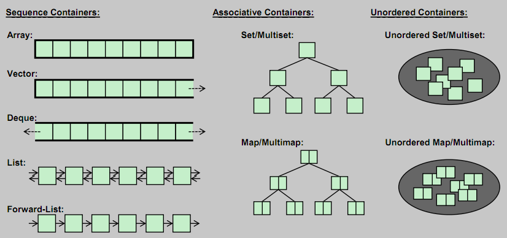
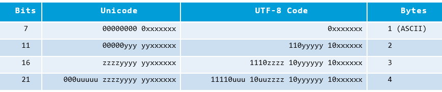

# C++

## system.cgi

Основное отличие от index.cgi в том, что при возврате ответа не возвращаются cookie. Это не продляет сессию.

Любые автоматические дествия или AJAX-скрипты, вызываемые на периодической основе, должны использовать system.cgi, во избежание обновления сессии.

В результате выполнения какого-либо действия в system.cgi необходимо заполнить

&#x20;`map<string,string>     mapResult;`

&#x20;который содержит все параметры возвращаемые из скрипта system.cgi.

Обязательные элементы `“type”, “result”`

## Convert dynamically linked elf to static linking

There are few tools that sometime work sometime not: [Ermine](http://magicermine.com/), [Statifier](http://statifier.sourceforge.net/), and [jumpstart](http://bitwagon.com/jumpstart/jumpstart.html). Some of those are paid versions.&#x20;

Another solution to achieve the goal is to copy all dynamic libraries to dedicated folder, set env variable `LD_LIBRARY_PATH` to that folder and run executable.&#x20;

Here is the containerized example:

Run container with dynamically linked elf based on ubuntu:xenial

```
docker run -it --rm --name dynamic_app connme.ru-app /bin/bash
```

&#x20; Collect linked libraries

```
ldd /home/httpd/www/cgi-bin/index.cgi
```

Copy all shared libs to a directory

```
mkdir /dynamic_libs
ldd /home/httpd/www/cgi-bin/index.cgi | awk '{ print $3; }' | grep -v 0x0 | xargs -n 1 -I {} cp {} /dynamic_libs/
```

Save cgi-bin and dynamic\_libs to local disk

```
docker cp dynamic_app:/home/httpd/www/cgi-bin cgi-bin
docker cp dynamic_app:/dynamic_libs dynamic_libs
```

Start clean container

```
docker run -it --rm --name static_app ubuntu:xenial /bin/bash
mkdir -p /dynamic_libs
mkdir -p /home/httpd/www/cgi-bin
```

Copy folders to the static\_app

```
docker cp cgi-bin static_app:/home/httpd/www/ 
docker cp dynamic_libs static_app:/
```

Inside static\_app container set env variabe and test the app:

```
export LD_LIBRARY_PATH=/dynamic_libs
cd /home/httpd/www/cgi-bin/
./index.cgi
```

## STL containers



## Smart-pointer notation

Способ 1:

`unique_ptr<char[]>     tempSmartPointer(new char[tempMessageLen]);`

Способ 2 (безопасный, поддерживается начиная с  С++14):

&#x20;`auto     tempSmartPointer = make_unique<char[]>(tempMessageLen);`

2-ой способ лучше:

* (2) Можно использовать для temporaries , (1) должен использовать new

```cpp
foo(make_unique<T>(), make_unique<U>()); // exception safe
foo(unique_ptr<T>(new T()), unique_ptr<U>(new U())); // unsafe*
```

* Не возникает утечки при «throw exception» во время memory allocation
* Правило - «никогда не использовать new» ! (2) – работает, (1) – не работает, хотя и нет проблем с владением ресурсом.
* (2) - один раз используется «имя типа», (1) – два раза, вроде как «излишек».

User-defined literal

```cpp
#include <iostream>
#include <string>
#include <cstddef>

// Define user defined literal "_quoted" operator.
std::string operator"" quoted(const char* text, std::size_t len) {
    return "\"" + std::string(text, len) + "\"";
}

int main() {
    std::cout << "tblCustomers"quoted << std::endl;
    std::cout << "cCustomerName"quoted << std::endl;
}
```

## Core dump & GDB

В случае если core dump не создается нужно разрешить его создание

1\) `ulimit –c unlimited`

После logout, ulimit сбросится обратно, что-бы сохранить настройки

```
vi /etc/security/limits.conf

www-data        soft    core            unlimited
www-data        hard    core            unlimited
ikuchin         soft    core            unlimited
ikuchin         hard    core            unlimited
root            soft    core            unlimited
root            hard    core            unlimited 
```

&#x20;2\) Разрешить apache2 создание coredumps

```
systemctl edit apache2
[Service]
LimitCORE=infinity
```

3\) место где будет core-фаил указывается:

```
sudo sysctl -w kernel.core_pattern=/tmp/core-%e.%p.%h.%t
cat /proc/sys/kernel/core_pattern
```

App must be compiled with debug information and symbols

For pure-make

* \-ggdb – debug info for GDB
* \-O0  - “O”-letter “0”-zerro , turn off code optimization

For cmake

```
cd ./build
cmake -DCMAKE_BUILD_TYPE=debug ..
make -j4
make install
```

Анализ core dump

```
gdb ./chat-server ./core

where – покажет stack и вызовы C++
bt (backtrace) – shown stack
bt full  – shown stack with local variables
list – show source 
list lineNumber – show source around line number
list function – show function 
show listsize / set listsize number – terminal length
```

In case of coredump hasn’t been created, reproduce the issue and check logs:

```
Oct 20 15:39:41.486092[9283] ERROR:crash_handler[23] /home/httpd/dev.timecard.ru/cgi-bin/helpdesk.cgi() [0x4a1e15]
Oct 20 15:39:41.486260[9283] ERROR:crash_handler[23] /lib/x86_64-linux-gnu/libc.so.6(+0x354b0) [0x7fe962d154b0]
Oct 20 15:39:41.486334[9283] ERROR:crash_handler[23] /lib/x86_64-linux-gnu/libc.so.6(memchr+0x19a) [0x7fe962d6e9fa]
Oct 20 15:39:41.486430[9283] ERROR:crash_handler[23] /home/httpd/dev.timecard.ru/cgi-bin/helpdesk.cgi() [0x46c9ed]
Oct 20 15:39:41.486537[9283] ERROR:crash_handler[23] /home/httpd/dev.timecard.ru/cgi-bin/helpdesk.cgi() [0x46e024]
Oct 20 15:39:41.486624[9283] ERROR:crash_handler[23] /home/httpd/dev.timecard.ru/cgi-bin/helpdesk.cgi() [0x4746d8]
Oct 20 15:39:41.486664[9283] ERROR:crash_handler[23] /home/httpd/dev.timecard.ru/cgi-bin/helpdesk.cgi() [0x439d7b]
Oct 20 15:39:41.486746[9283] ERROR:crash_handler[23] /home/httpd/dev.timecard.ru/cgi-bin/helpdesk.cgi() [0x410a53]
Oct 20 15:39:41.486846[9283] ERROR:crash_handler[23] /lib/x86_64-linux-gnu/libc.so.6(__libc_start_main+0xf0) [0x7fe962d00830]
Oct 20 15:39:41.486967[9283] ERROR:crash_handler[23] /home/httpd/dev.timecard.ru/cgi-bin/helpdesk.cgi() [0x409dc9]
```

GDB actions:

```
gdb helpdesk.cgi
info line *0x46c9ed
```

In this case stack looks like this:

* crash\_handler
* libc.so
* libc.so memchr
* crequest.cpp:91
* ….

## Print stack-trace

```cpp
#include <stdio.h>
#include <execinfo.h>
#include <signal.h>
#include <stdlib.h>
#include <unistd.h>

void handler(int sig) {
  void *array[10];
  size_t size;

  // get void*'s for all entries on the stack
  size = backtrace(array, 10);

  // print out all the frames to stderr
  fprintf(stderr, "Error: signal %d:\n", sig);
  backtrace_symbols_fd(array, size, STDERR_FILENO);
  exit(1);
}

void baz() {
 int *foo = (int*)-1; // make a bad pointer
  printf("%d\n", *foo);       // causes segfault
}

void bar() { baz(); }
void foo() { bar(); }

int main(int argc, char **argv) {
  signal(SIGSEGV, handler);   // install our handler
  foo(); // this will call foo, bar, and baz.  baz segfaults.
}

$ gcc -g -rdynamic ./test.c -o test
Executing this gets you this output:

$ ./test
Error: signal 11:
./test(handler+0x19)[0x400911]
/lib64/tls/libc.so.6[0x3a9b92e380]
./test(baz+0x14)[0x400962]
./test(bar+0xe)[0x400983]
./test(foo+0xe)[0x400993]
./test(main+0x28)[0x4009bd]
/lib64/tls/libc.so.6(__libc_start_main+0xdb)[0x3a9b91c4bb]
./test[0x40086a]
```

## Valgrind

Print stack info on segmentation fault

&#x20;`valgrind ./test.app`

&#x20;Mem-leak checker

&#x20;`valgrind -–leak-check=full -–tool=memcheck ./test.app`

&#x20;Callgrind is call profiler. Can provide summary cost or cost for each  func.

&#x20;`valgrind -–tool=callgrind ./test.app`

&#x20;Delayed run of callgrind

```
valgrind –-instr-atstart=no -–tool=callgrind ./test.app
callgrind_control –i on
callgrind_control –i off
```

&#x20;Result interpretation

```
callgrind_annotate [opt] callgrind.out.<pid>
 
--inclusive=yes cost variations
--tree=both Interleave into the top level list of functions, information on the callers and the callees of each function. In these lines, which represents executed calls, the cost gives the number of events spent in the call. Indented, above each function, there is the list of callers, and below, the list of callees. The sum of events in calls to a given function (caller lines), as well as the sum of events in calls from the function (callee lines) together with the self cost, gives the total inclusive cost of
```


## G++ libraries linkage

Libraries must be at the end of link statement

**dynamic library** - g++ -o result -L /path/to/.so obj1.o obj2.o -lhpdf (w/o lib)

**static library** - g++ -o result -L /path/to/.so obj1.o obj2.o -l:libhpdf (w/ lib and ":" column)

&#x20;Notes from compiler about dynamic library linkage:

If you ever happen to want to link against installed libraries in a given directory, LIBDIR, you must either use libtool, and specify the full pathname of the library, or use the '-LLIBDIR' flag during linking and do at least one of the following:

* add LIBDIR to the 'LD\_LIBRARY\_PATH' environment variable during execution
* add LIBDIR to the 'LD\_RUN\_PATH' environment variable during linking
* use the '-Wl,-rpath -Wl,LIBDIR' linker flag
* have your system administrator add LIBDIR to '/etc/ld.so.conf'

## &#x20;Unicode and UTF

**Unicode (aka ISO/IEC 10646 Universal Character Set)**

Before Unicode, no single character encoding scheme could represent characters in all languages. For example, western european uses several encoding schemes (in the ISO-8859-x family). Even a single language like Chinese has a few encoding schemes (GB2312/GBK, BIG5). Many encoding schemes are in conflict of each other, i.e., the same code number is assigned to different characters.

Unicode aims to provide a standard character encoding scheme, which is universal, efficient, uniform and unambiguous. Unicode standard is maintained by a non-profit organization called the Unicode Consortium (@ [www.unicode.org](http://www.unicode.org/)). Unicode is an ISO/IEC standard 10646.

Unicode is backward compatible with the 7-bit US-ASCII and 8-bit Latin-1 (ISO-8859-1). That is, the first 128 characters are the same as US-ASCII; and the first 256 characters are the same as Latin-1.

Unicode originally uses 16 bits (called UCS-2 or Unicode Character Set - 2 byte), which can represent up to 65,536 characters. It has since been expanded to more than 16 bits, currently stands at 21 bits. The range of the legal codes in ISO/IEC 10646 is now from U+0000H to U+10FFFFH (21 bits or about 2 million characters), covering all current and ancient historical scripts. The original 16-bit range of U+0000H to U+FFFFH (65536 characters) is known as _Basic Multilingual Plane_ (BMP), covering all the major languages in use currently. The characters outside BMP are called _Supplementary Characters_, which are not frequently-used.

Unicode has two encoding schemes:

* **UCS-2** (Universal Character Set - 2 Byte): Uses 2 bytes (16 bits), covering 65,536 characters in the BMP. BMP is sufficient for most of the applications. UCS-2 is now obsolete.
* **UCS-4** (Universal Character Set - 4 Byte): Uses 4 bytes (32 bits), covering BMP and the supplementary characters.

.png>)

**UTF-8 (Unicode Transformation Format - 8-bit)**

The 16/32-bit Unicode (UCS-2/4) is grossly inefficient if the document contains mainly ASCII characters, because each character occupies two bytes of storage. Variable-length encoding schemes, such as UTF-8, which uses 1-4 bytes to represent a character, was devised to improve the efficiency. In UTF-8, the 128 commonly-used US-ASCII characters use only 1 byte, but some less-commonly characters may require up to 4 bytes. Overall, the efficiency improved for document containing mainly US-ASCII texts.

The transformation between Unicode and UTF-8 is as follows:




In UTF-8, Unicode numbers corresponding to the 7-bit ASCII characters are padded with a leading zero; thus has the same value as ASCII. Hence, UTF-8 can be used with all software using ASCII. Unicode numbers of 128 and above, which are less frequently used, are encoded using more bytes (2-4 bytes). UTF-8 generally requires less storage and is compatible with ASCII. The drawback of UTF-8 is more processing power needed to unpack the code due to its variable length. UTF-8 is the most popular format for Unicode.

Notes:

·         UTF-8 uses 1-3 bytes for the characters in BMP (16-bit), and 4 bytes for supplementary characters outside BMP (21-bit).

·         The 128 ASCII characters (basic Latin letters, digits, and punctuation signs) use one byte. Most European and Middle East characters use a 2-byte sequence, which includes extended Latin letters (with tilde, macron, acute, grave and other accents), Greek, Armenian, Hebrew, Arabic, and others. Chinese, Japanese and Korean (CJK) use three-byte sequences.

·         All the bytes, except the 128 ASCII characters, have a leading `'1'` bit. In other words, the ASCII bytes, with a leading `'0'` bit, can be identified and decoded easily.

**Example**: 您好 `(Unicode: 60A8H 597DH)`

```
Unicode (UCS-2) is 60A8H = 0110 0000 10 101000B
⇒ UTF-8 is 11100110 10000010 10101000B = E6 82 A8H

Unicode (UCS-2) is 597DH = 0101 1001 01 111101B
⇒ UTF-8 is 11100101 10100101 10111101B = E5 A5 BDH
```

## Initial action

.png>)
