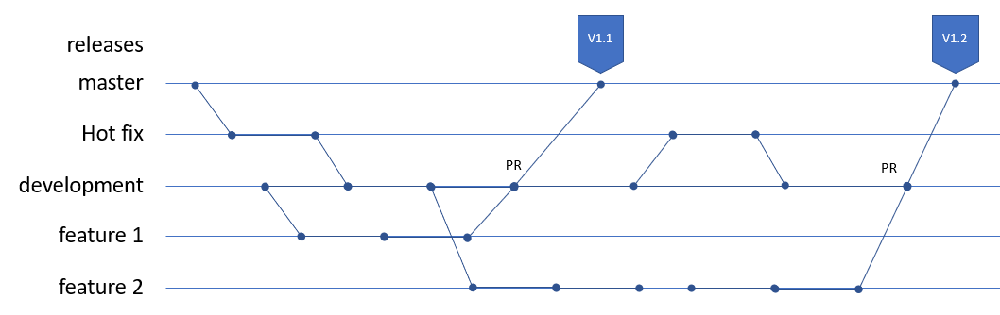

# Git

## Github guide

* Settings -> Branches -> master & development -> Require pull request
* Security -> Enable dependabot
* Security -> Instal CodeQL

## Branching best practice

MASTER – only PR-s to _master_, no _push_

RELEASE – snapsot of master release in time

HOTFIX – branch for urgent fixes into _master_ and _development_

TEST – pre-development branch used for Quality Assurance testing

DEVELOPMENT – active development

FEATURE – branches used for feature development

## Git basic operations

